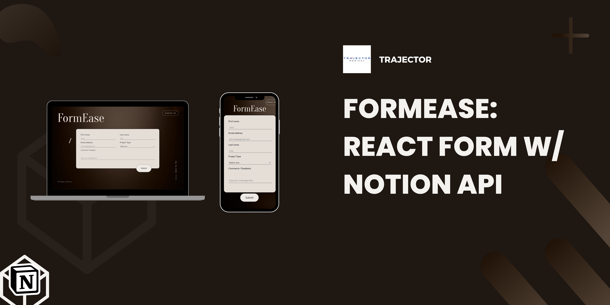

# FormEase: A ReactJS Form with Notion API

**Project Overview:**  
This project is a ReactJS-based web application that integrates with the Notion API to create and manage forms. The application allows users to design custom forms and store submitted data in a Notion database.

## Features

- Create and customize forms using a user-friendly interface.
- Connect to a Notion database to store form submissions.
- Have a configured form validation.
- Implement Google reCAPTCHA for form security.
- Display toast notifications for user feedback.

## Dependencies

### Client Folder

- **react**
- **react-google-recaptcha**
- **react-player**
- **react-toastify**

### Server Folder

- **@notionhq/client**
- **cors**
- **dotenv**
- **express**
- **nodemon**

## Getting Started

To run this application locally, follow these steps:

### IMPORTANT!!!

**Follow the instructions on this YouTube video on how to create a Notion account and how to setup the integration and database:**

<u>https://www.youtube.com/watch?v=WbekTHVISh0</u>

**1. Clone the repository:**

```
git clone <repository-url>
```

**2. Install dependencies for both the client and server folders. Split the terminal to have them both running:**

- **Client**

```
cd client
npm install

```

- **Server**

```
cd server
npm install

```

**3. Set up environment variables:**

- Create a .env file in the server folder and add your Notion API integration token.
- Configure other environment variables as needed.

**The environment variables are:**

- PORT
- HOST
- NOTION_SECRET (secret API key from Notion)
- DATABASE_ID (this can be retrieved from the URL)

**4. Start the server:**

```
cd ../server
npm start

```

**5. Start the client:**

```
cd ../client
npm start

```

**6. Access the application in your browser at http://localhost:3000.**

## Usage

- **Design and customize your forms using the client application.**
- **Connect the client to a Notion database by providing the integration token and database information.**
- **Implement Google reCAPTCHA for form security.**
- **Start receiving and managing form submissions in your Notion database.**
- **Enjoy toast notifications for user feedback.**

## Contributors

- <u>Emmanuel Jason De Lara</u>
